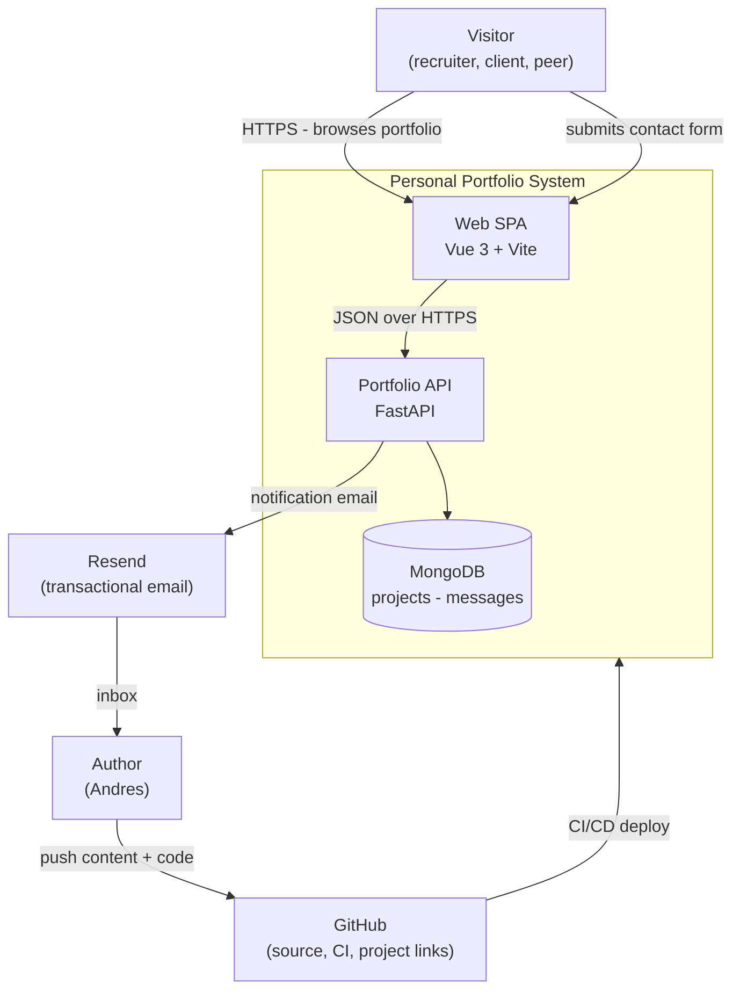
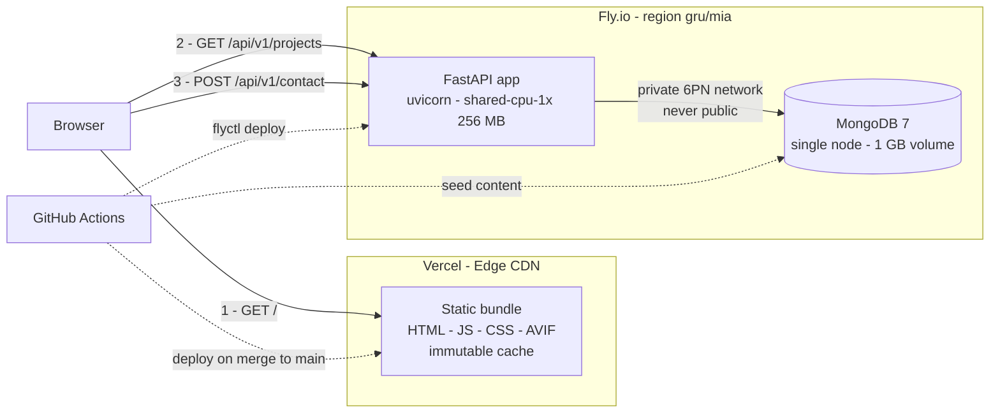
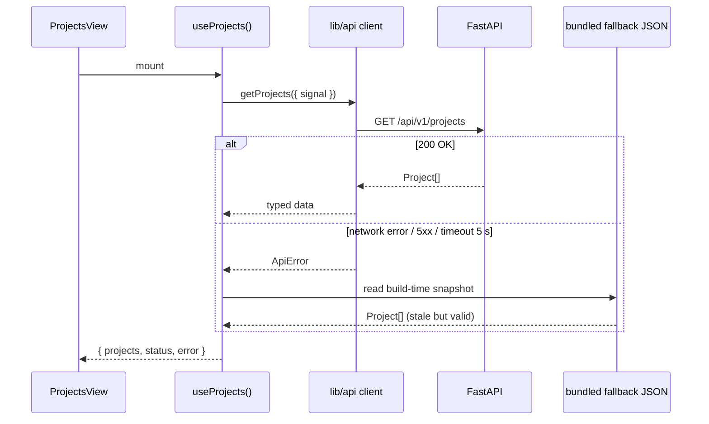
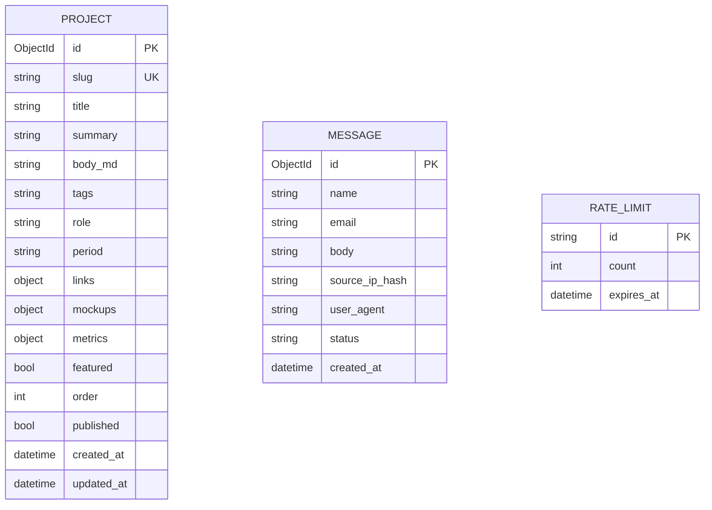
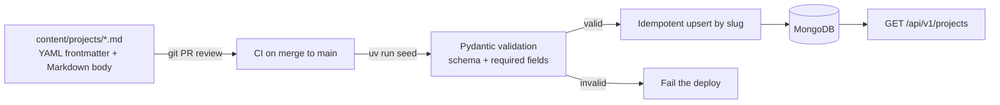
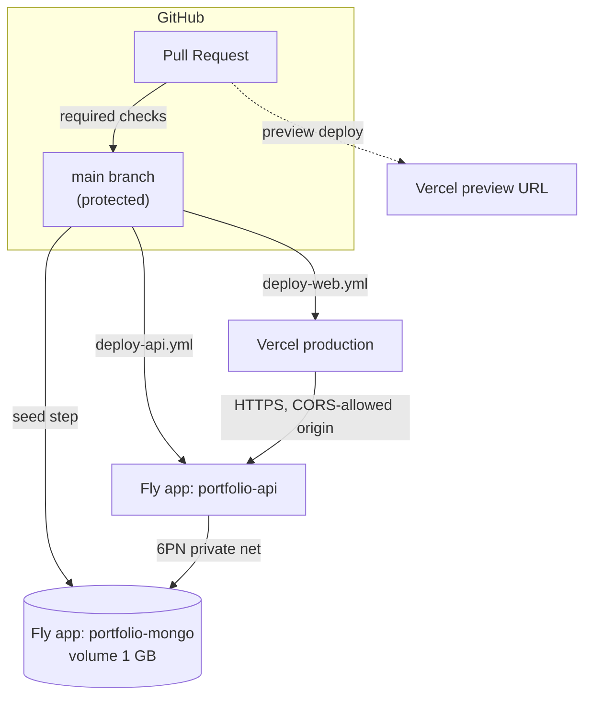
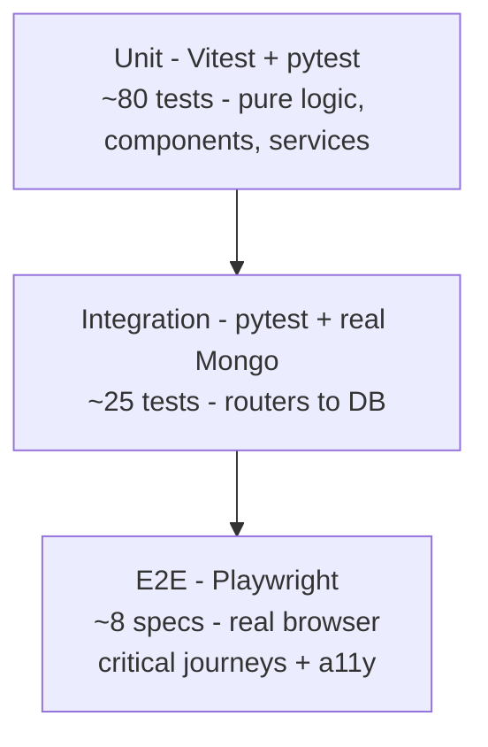

# Architecture — Personal Portfolio

> Status: **Accepted** · Last updated: 2026-08-26 · Owner: Andrés M (@ThePawn8)

This document is the single source of truth for *how* the system is built and *why*.
Implementation work is tracked in [IMPLEMENTATION_PLAN.md](./IMPLEMENTATION_PLAN.md);
live state across sessions lives in [../PROGRESS.md](../PROGRESS.md).

---

## 1. Purpose

A production-grade personal portfolio that does two jobs at once:

1. **Communicates** professional experience and projects to recruiters and clients.
2. **Is itself the strongest work sample** — the repository, its tests, its CI and its
   deployment pipeline are part of what is being evaluated.

Every decision below is judged against that second goal: if a simpler option would make the
codebase less interesting to a senior reviewer, the trade-off is stated explicitly.

### 1.1 Goals

| # | Goal | How it is verified |
|---|------|--------------------|
| G1 | Present projects with links, descriptions and mockups | Content pipeline + `/projects` views |
| G2 | Demonstrate frontend engineering (Vue 3, TS strict, testing) | CI gates, Vitest + Playwright |
| G3 | Demonstrate backend engineering (FastAPI, async, typed, tested) | pytest ≥ 80 % coverage, mypy strict |
| G4 | Be genuinely production-deployed, not a localhost demo | Public URL, healthchecks, uptime monitor |
| G5 | Load fast on a mid-range phone | Performance budget (§ 12) enforced in CI |
| G6 | Be cheap to run and to keep alive | ≤ USD 5 / month, no manual ops in normal weeks |

### 1.2 Non-goals

- **Not a CMS.** Content is authored in git, not in an admin UI. Rejected during planning:
  an authenticated CRUD panel triples the security surface for a site edited ~monthly.
- **Not multi-tenant, not multi-user.** There is exactly one author and no login.
- **Not internationalised (v1).** English only; see ADR-0006.
- **Not server-rendered (v1).** SPA with a documented SEO limitation; see ADR-0002.

---

## 2. Quality attributes

The non-functional requirements the design optimises for, in priority order.

| Attribute | Target | Enforcement |
|---|---|---|
| Performance | LCP ≤ 2.0 s (mobile, 4G), JS ≤ 180 KB gzip, CLS ≤ 0.05 | Lighthouse CI budget, bundle-size gate |
| Accessibility | WCAG 2.2 AA, full keyboard navigation | axe-core in Playwright e2e |
| Correctness | ≥ 80 % coverage both apps, strict typing | `pytest --cov-fail-under`, `mypy --strict`, `vue-tsc` |
| Security | No secrets in repo, security headers, rate-limited writes | gitleaks, pip-audit, npm audit, header e2e test |
| Availability | Best-effort 99 % — the site degrades, never blanks | Static content fallback when API is down (§ 6.4) |
| Maintainability | A stranger can run it in one command | `make dev`, documented in README |
| Cost | ≤ USD 5 / month | Fly.io shared-cpu-1x + Vercel Hobby |

---

## 3. System context (C4 level 1)



---

## 4. Container view (C4 level 2)



**Why the API is a separate container rather than Vercel functions:** a long-lived process
keeps one Mongo connection pool warm (serverless opens a connection per invocation, which a
single-node Mongo handles badly), and it makes the Python service a real, inspectable
deployment artefact — which is the point of § 1 G3.

---

## 5. Frontend architecture

### 5.1 Stack

| Concern | Choice | Rationale |
|---|---|---|
| Framework | Vue 3.5 (`<script setup>`, Composition API) | Target role is Vue; idiomatic modern Vue is the work sample |
| Build | Vite 8 | Fast HMR, native ESM, first-class Vue support |
| Language | TypeScript 6, `strict` | Type errors fail the build |
| Routing | vue-router 5, lazy-loaded routes | Code-splitting per view |
| State | Pinia (only where shared) | Local `ref`s stay local; no store-everything anti-pattern |
| Styling | Tailwind v4 + semantic design tokens | Tokens in CSS vars → themable; utilities → no dead CSS |
| Head/SEO | `@unhead/vue` | Per-route `<title>`, description, canonical, OG |
| HTTP | Native `fetch` wrapped in a typed client | Zero dependency; typed errors; abortable |

### 5.2 Layering

```
src/
├── views/        Route-level components. Own data fetching + page <head>.
├── components/   Presentational, prop-driven, no network calls, unit-testable.
├── composables/  Reusable reactive logic (useProjects, useTheme, useContactForm).
├── lib/          Framework-free: api client, formatters, guards. Pure TS, 100 % unit-tested.
├── stores/       Pinia. Only cross-route shared state.
├── types/        Domain types mirroring the API contract.
└── assets/       Source images (optimised at build) + tokens.css
```

**Dependency rule:** dependencies point downward only —
`views → components → composables → lib`. `lib/` imports nothing from the layers above it,
which is what makes it testable without mounting Vue.

### 5.3 Data flow



The fallback (§ 6.4) is what turns an API outage into *slightly stale content* instead of an
empty portfolio in front of a recruiter.

### 5.4 The SPA/SEO trade-off (explicit)

An SPA was chosen (ADR-0002). The honest consequence:

- **Google** executes JS and will index the rendered content — acceptable.
- **LinkedIn, WhatsApp, Slack and X do not execute JS.** Sharing a deep link to a project
  shows the site-wide OG card, not that project's own preview.

Mitigations shipped in v1: static site-wide OG image and rich meta in `index.html`,
per-route `<head>` for browser tabs and Google, `sitemap.xml` + `robots.txt`.
The escape hatch stays open by keeping routes data-driven: adding `vite-ssg` prerendering
later is a build-config change, not a rewrite. Tracked as **T-503**.

---

## 6. Backend architecture

### 6.1 Stack

| Concern | Choice | Rationale |
|---|---|---|
| Framework | FastAPI (async) | Typed request/response, OpenAPI for free, ASGI |
| Server | uvicorn (1 worker, 256 MB) | Traffic is tiny; a second worker doubles the Mongo pool for nothing |
| ODM | Beanie (Pydantic v2 over Motor) | Documents *are* typed models — one schema, no drift |
| Database | MongoDB 7, single node on a Fly volume | ADR-0003 |
| Validation | Pydantic v2 | Same library validates HTTP and DB shapes |
| Config | pydantic-settings | Env-driven, fails fast at boot on missing secrets |
| Logging | structlog → JSON | Machine-readable logs with request correlation ids |
| Email | Resend HTTP API | 3 000/month free, good deliverability, no SMTP credentials |
| Packaging | uv + pyproject | Reproducible lockfile, fast CI installs |

### 6.2 Layering

```
src/portfolio_api/
├── main.py            App factory, lifespan (Mongo connect/disconnect), middleware wiring
├── core/
│   ├── config.py      Settings (pydantic-settings) — the only place os.environ is read
│   ├── logging.py     structlog config + request-id contextvar
│   ├── errors.py      Domain exceptions → RFC 9457 problem+json handlers
│   └── ratelimit.py   Fixed-window limiter backed by a Mongo TTL collection
├── models/            Beanie Documents (persistence shape)
├── schemas/           Pydantic API models (wire shape) — deliberately NOT the same class
├── repositories/      All Mongo queries live here. Nothing else touches the driver.
├── services/          Business rules: contact submission, project queries, seeding
├── routers/           HTTP only: parse, delegate, serialise. No logic.
└── seed/              Markdown/YAML → validated documents → idempotent upsert
```

**Why `models/` and `schemas/` are separate classes** even though it costs a mapping
function: the DB shape must be free to change (add `internal_notes`, `draft`, timestamps)
without leaking those fields to the public API. Coupling them is the most common way private
data escapes.

### 6.3 Error model — RFC 9457 `application/problem+json`

Every non-2xx response has one shape, so the client has exactly one error path:

```json
{
  "type": "https://portfolio.dev/errors/validation-error",
  "title": "Validation error",
  "status": 422,
  "detail": "email: value is not a valid email address",
  "instance": "/api/v1/contact",
  "request_id": "01JC4Z8K7Q3M"
}
```

### 6.4 Resilience: the build-time content snapshot

At web build time, CI calls `GET /api/v1/projects` and writes the result to
`src/assets/projects.fallback.json`, bundled into the SPA. If the API is unreachable at
runtime, the UI renders that snapshot and shows a subtle "showing cached content" notice.
Consequences accepted: the snapshot is as old as the last deploy, and it costs ~10 KB gzip.
If the API is down *at build time*, CI keeps the previously committed snapshot rather than
failing the deploy.

### 6.5 Public API surface

| Method | Path | Purpose | Cache | Rate limit |
|---|---|---|---|---|
| GET | `/api/v1/projects` | List published projects (sorted, filterable by `tag`) | `public, max-age=300` + ETag | 60/min/IP |
| GET | `/api/v1/projects/{slug}` | One project with full body | `public, max-age=300` + ETag | 60/min/IP |
| GET | `/api/v1/profile` | Bio, experience, education, skills, CV link | `public, max-age=300` | 60/min/IP |
| POST | `/api/v1/contact` | Submit contact message → 202 Accepted | `no-store` | 5/hour/IP |
| GET | `/healthz` | Liveness — process is up | `no-store` | — |
| GET | `/readyz` | Readiness — Mongo reachable | `no-store` | — |
| GET | `/docs`, `/openapi.json` | Interactive contract | — | — |

Versioned under `/api/v1` from day one: cheap now, and it is the difference between shipping
a breaking change and breaking a live page.

---

## 7. Data model



Field notes: `summary` ≤ 200 chars (used in cards and meta tags); `links` holds
`live · repo · case_study · video`; `mockups` is a list of `{src, alt, caption, width,
height}`; `metrics` is a list of `{label, value}` for impact numbers; `source_ip_hash` is a
SHA-256, never the raw IP; `rate_limits.id` is `sha256(ip):route:window`.

**Indexes:** `projects.slug` (unique), `projects.{published, featured, order}` (compound —
covers the list query), `projects.tags`, `messages.created_at` (desc),
`rate_limits.expires_at` (TTL 0 → documents self-delete).

**Why hash the IP:** rate limiting needs a stable per-client key, not an identity. Hashing
gives the same guarantee while keeping the store free of personal data — GDPR-friendly by
construction.

### 7.1 Content pipeline



Content is code: reviewed in a PR, versioned, and a malformed project fails CI instead of
appearing broken in production. The seed is **idempotent** (upsert by `slug`) and
**additive** — it never deletes; removing a project means setting `published: false`.

---

## 8. Infrastructure & deployment



| Environment | Web | API | Data |
|---|---|---|---|
| local | `vite dev` :5173 | `uvicorn --reload` :8000 | Mongo in Docker :27017 |
| preview (per PR) | Vercel preview URL | production API (read paths) | production Mongo |
| production | `*.vercel.app` → custom domain later | `portfolio-api.fly.dev` | Fly volume |

**Secrets** live in GitHub Actions secrets and `fly secrets`; never in the repo.
`.env.example` documents every variable with a safe placeholder. `gitleaks` runs in CI.

**Mongo exposure:** the Mongo app has **no public IP**; it is reachable only over Fly's
private IPv6 network from the API app. Authentication is enabled regardless — defence in
depth.

---

## 9. Security

| Risk | Control |
|---|---|
| Contact-form spam / abuse | Honeypot field + 5/hour/IP rate limit + max body length + Pydantic validation |
| Secret leakage | gitleaks in CI, `.env` gitignored, secrets only in Fly/GitHub stores |
| Vulnerable dependencies | `npm audit --audit-level=high` + `pip-audit` in CI, Dependabot weekly |
| XSS via project Markdown | Markdown rendered to sanitised HTML at seed time; no `v-html` on unsanitised input |
| Cross-origin abuse | CORS allowlist (exact origins, never `*`), only the methods actually used |
| Clickjacking / MIME sniffing | CSP, `X-Content-Type-Options`, `Referrer-Policy`, HSTS via Vercel headers config |
| DB compromise | Private network only, auth enabled, least-privilege application user |
| PII retention | Only the name/email/message the visitor typed; IPs stored hashed |

---

## 10. Observability

- **Structured logs:** JSON to stdout, one line per request with `request_id`, method, path,
  status and `duration_ms`. Fly aggregates them; `fly logs` is the debugging entry point.
- **Correlation:** middleware assigns a ULID `request_id`, echoed in the `X-Request-ID`
  response header and included in every error payload — a visitor can quote it in a report.
- **Health:** `/healthz` (liveness, no dependencies) vs `/readyz` (pings Mongo). Fly uses
  `/healthz` for restarts; `/readyz` is the human and uptime-monitor check.
- **Uptime:** external monitor hitting `/readyz` every 5 min with email alerts (T-405).
- **Errors:** Sentry is deliberately deferred — at this traffic volume structured logs are
  enough. Revisit if the contact form ever fails silently.

---

## 11. Testing strategy



| Level | Tooling | Scope | Runs |
|---|---|---|---|
| Unit (web) | Vitest + @vue/test-utils + jsdom | `lib/`, composables, components in isolation | every PR |
| Unit (api) | pytest | services, validation, seed parsing — no I/O | every PR |
| Integration (api) | pytest + `httpx.ASGITransport` + Mongo service container | Router → service → repository → real Mongo | every PR |
| Contract | Snapshot of `openapi.json` | Fails when the public contract changes silently | every PR |
| E2E | Playwright (chromium) + axe-core | Home → project → contact submit; keyboard nav; a11y violations | every PR |

**Explicitly not mocked:** Mongo in integration tests. A mocked database proves the mock
works. Resend *is* mocked — no real email is ever sent from CI.

---

## 12. Performance budgets (CI-enforced)

| Metric | Budget | Gate |
|---|---|---|
| JS transferred (initial route) | ≤ 180 KB gzip | bundle-size check fails the build |
| CSS | ≤ 30 KB gzip | same |
| LCP (mobile, throttled) | ≤ 2.0 s | Lighthouse CI assertion |
| CLS | ≤ 0.05 | Lighthouse CI assertion |
| Lighthouse Perf / A11y / SEO / Best Practices | ≥ 95 / 100 / 100 / 100 | Lighthouse CI assertion |
| API p95 (`GET /projects`, warm) | ≤ 150 ms | post-deploy smoke test |

Techniques: route-level code splitting, a separate `vendor` chunk, AVIF/WebP `<picture>`
with explicit `width`/`height` (no CLS), `font-display: swap` over a system-font fallback
stack, and `Cache-Control: immutable` on hashed assets.

---

## 13. Risks

| Risk | Likelihood | Impact | Mitigation |
|---|---|---|---|
| Single-node Mongo loses its volume | Low | High — all content gone | Source of truth is git; `make seed` rebuilds the DB in seconds |
| Fly free allowance changes / app suspended | Medium | Medium | Snapshot fallback keeps the site readable; the API is one Dockerfile, portable to Render/Railway |
| SPA hurts social link previews | Certain | Medium | Documented § 5.4; T-503 adds prerendering if it matters |
| Scope creep delays going live | High | High | T-4xx deploy tickets are scheduled *before* polish tickets — ship, then refine |
| Content never gets written | Medium | High — an empty portfolio is worse than none | Content tickets (T-3xx) are first-class, with a per-project template |

---

## 14. Architecture decision records

| ADR | Decision | Status |
|---|---|---|
| [0001](./adr/0001-monorepo-layout.md) | Single repo, `apps/web` + `apps/api` | Accepted |
| [0002](./adr/0002-spa-over-ssr.md) | Vue SPA instead of Nuxt SSR/SSG | Accepted |
| [0003](./adr/0003-mongodb-self-hosted.md) | Self-hosted MongoDB on Fly.io | Accepted |
| [0004](./adr/0004-content-in-git.md) | Content in git, seeded to Mongo | Accepted |
| [0005](./adr/0005-error-contract.md) | RFC 9457 problem+json error contract | Accepted |
| [0006](./adr/0006-english-only.md) | English-only v1 | Accepted |
